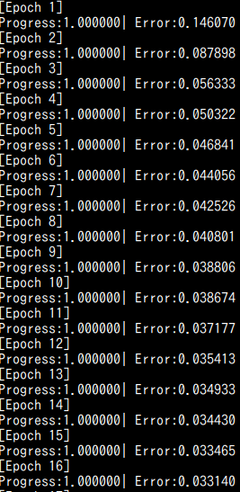
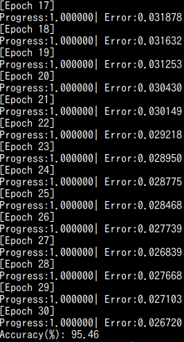

# C++ ディープニューラルネットワーク デモ
ディープニューラルネットワークのデモをC++で実装。

### Prerequisites
* Eigen(C++ライブラリー)
* Google Test(C++ユニットテストライブラリー)
* MNISTデータを取り出すために使用する外部ライブラリー(https://github.com/wichtounet/mnist)

### MNISTデータセットの識別(コードの一部を表示。詳細は、/examples/mnist.cpp)
```cpp
  int training_data_size = 60000;
  int test_data_size = 10000;
  
  int input_height = 28;
  int input_width = 28;
  
  //Dense network({784,30,10},{Activations::Relu,Activations::Relu},Losses::CategoricalCrossEntropy);
  //network.SetLearningRate(1e-4);
  Dense network({784,30,10},{Activations::Sigmoid,Activations::Sigmoid},Losses::Mse);
  network.SetLearningRate(0.5);
  
  Eigen::Tensor<double,2> training_data(training_data_size,784);
  Eigen::Tensor<double,2> training_labels(training_data_size,10);
  Eigen::Tensor<double,2> test_data(test_data_size,784);
  Eigen::Tensor<double,2> test_labels(test_data_size,10);

  // データを初期化。
  InitDataset(training_data,training_labels,training_data_size,
	      test_data,test_labels,test_data_size);

  // Epochを30にして学習。
  Train(network,training_data,training_labels,training_data_size,30);

  // 精度測定。
  MeasureAccuracy(network,test_data,test_labels,test_data_size);

```
### 上記を実行後のターミナルを表示



### テスト
``` bash
> cd ./tests
> mkdir build && cd build
> cmake ..
> make
> ./test_all
```

### MNIST識別デモ
```bash
> cd ./examples
> mkdir build && cd build
> cmake ..
> make
> ./mnist
```
